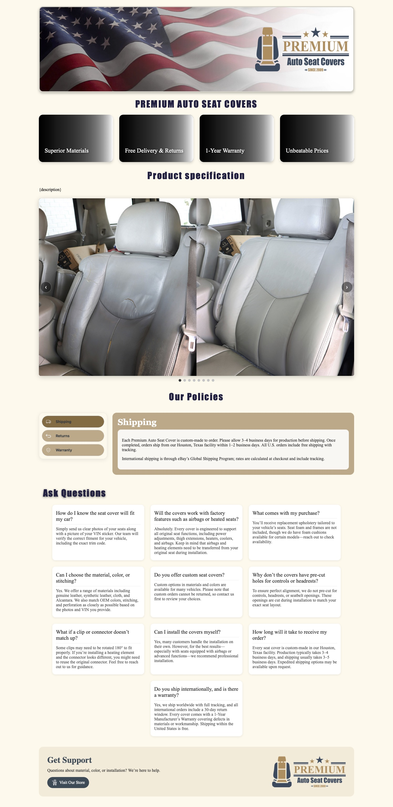
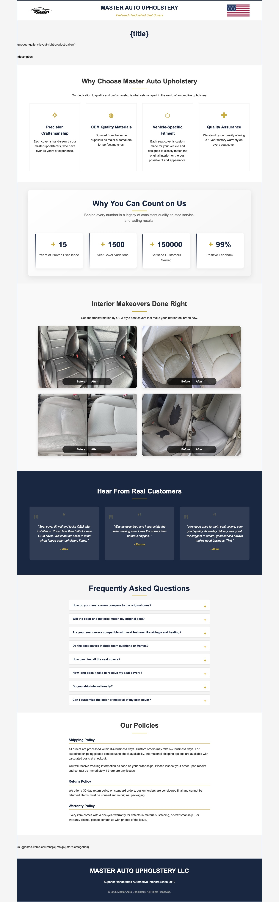
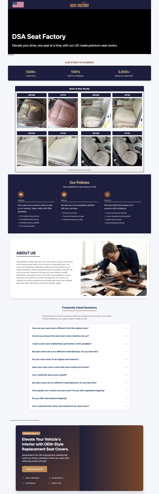
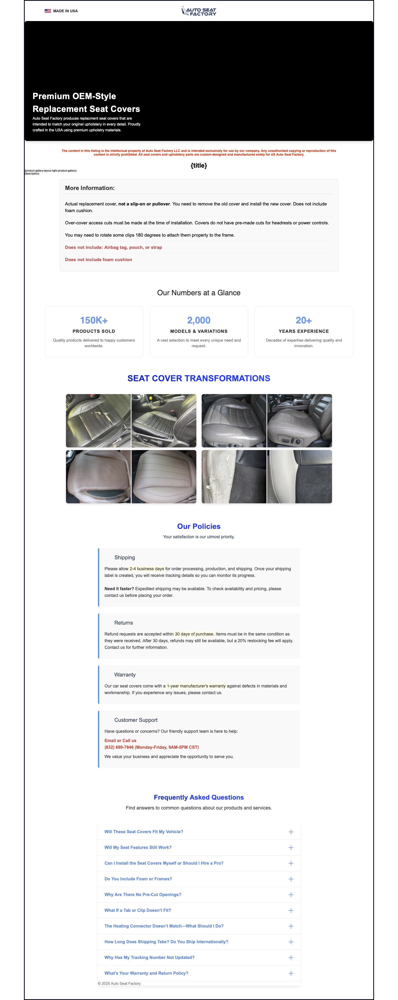
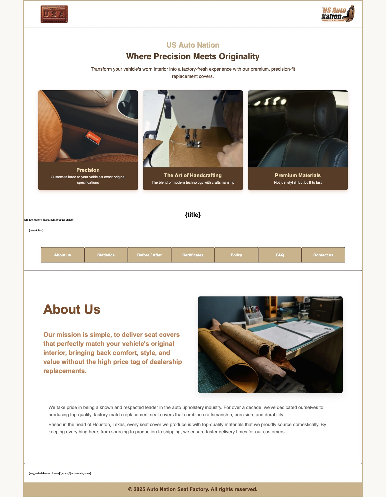
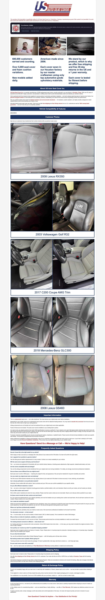
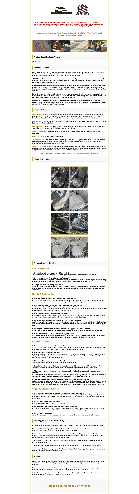

# 🛒 eBay Listing Templates (7-pack)

Seven **eBay-friendly HTML templates**, each as a **single file** with inline CSS — optimized for the eBay listing editor.

---

## ⚠️ eBay Restrictions
- eBay does **not** allow JavaScript in product descriptions.
- External CSS files are **blocked** → all styles here are **inline**.
- Templates include placeholders (e.g., `{{TITLE}}`, `{{DESCRIPTION_HTML}}`) that you can replace manually or map to your eBay data.

---

## 📂 Templates
- **Template 1:** Hero banner + 4-feature grid + CSS-only slideshow + spec table styling  
- **Template 2:** Header with logo/flag + features grid + stats section  
- **Template 3:** Header + large-type **FAQ accordion** (CSS-only)  
- **Template 4:** Responsive header/menu + **gallery grid** with overlays  
- **Template 5:** Brown/Beige theme + responsive header + gallery & sections  
- **Template 6:** Clean container + **SEMA trust bar** + highlights/FAQ  
- **Template 7:** Minimal centered layout with dual header images and sections

---

## 🔧 How to Use
1. Open any `template-*.html`.
2. Copy the full HTML into the eBay listing editor.

> Tip: Host images on a reliable CDN or eBay image hosting.

---

## 🖼️ Preview

| Template 1 | Template 2 | Template 3 |
|---|---|---|
|  |  |  |

| Template 4 | Template 5 | Template 6 |
|---|---|---|
|  |  |  |

| Template 7 |
|---|
|  |

---

## 📄 License
MIT © 2025 Amanda Taheri
